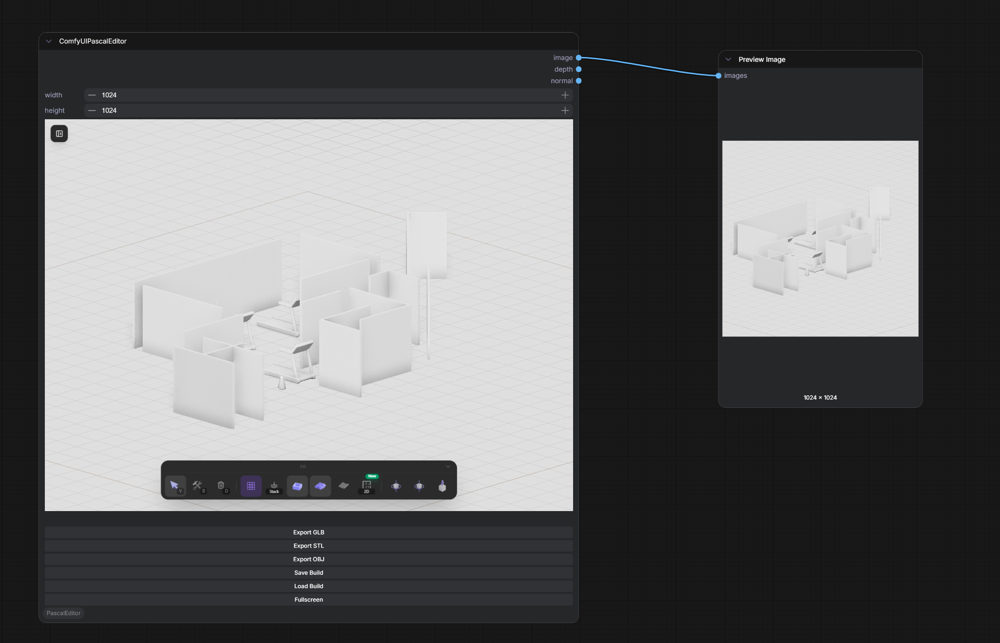

# ComfyUI-PascalEditor

一个将 [Pascal Editor](https://github.com/pascalorg/editor)（全功能 3D 建筑编辑器）直接集成到 ComfyUI 工作流中的插件。

[English](README.md)



## 更新说明（v0.3.0）

本版本将内置的 Pascal Editor 从 `0.3.x` 更新到上游 **[v0.6.0](https://github.com/pascalorg/editor/blob/main/CHANGELOG.md)**，为 ComfyUI 插件带来大量编辑器改进：

- **多表面材质系统** — 墙体、楼梯、屋顶支持按表面分别设置材质，可在 3D 场景中点选编辑
- **13 种预设材质** — 花岗岩、大理石、拼花地板、墙纸、木材等
- **自动房间识别** — 闭合墙体自动切分并生成 slab 与顶棚
- **楼梯 - slab 联动** — 楼梯自动在 slab 和顶棚中挖洞
- **曲线墙体与曲线围栏**（含端点拖动工具）
- **第一人称 / 街景漫游模式**
- **编辑器布局 v2 重设计** + 3D 框选
- **建筑整体移动 / 旋转** 与所有工具的相对定位
- **网格吸附工具栏控件**，以及 slab / 顶棚的 **挖洞按钮**
- **可编辑墙体长度 slider** 与无限拖拽 slider
- **WebGPU 渲染器** 改进与回退处理
- 大量崩溃修复、撤销 / 重做、吸附与后处理相关修复

## 功能特性

- **完整的 3D 建筑编辑器** — 在 ComfyUI 节点中直接创建和编辑建筑、墙体、地板、天花板、屋顶、门窗、楼梯、围栏和区域
- **截图输出** — 运行工作流时自动捕获当前 3D 视口画面作为 IMAGE 输出，可直接用于 img2img、ControlNet 等
- **可配置分辨率** — 节点上的 width/height 控制输出图片大小（中心裁切 + LANCZOS 缩放，不拉伸变形）
- **3D 模型导出** — 通过节点按钮导出 GLB、STL 或 OBJ 格式的 3D 模型
- **场景保存和加载** — 将建筑布局保存为 JSON 文件，随时重新加载
- **全屏模式** — 在全屏对话框中打开编辑器，获得更好的编辑体验
- **顶部菜单** — ComfyUI 顶部菜单栏快捷访问按钮
- **可折叠 UI** — 侧边栏和工具栏可折叠/拖拽，最大化视口空间

## 安装

将此仓库克隆到 ComfyUI 的 `custom_nodes` 目录：

```bash
cd ComfyUI/custom_nodes
git clone https://github.com/jtydhr88/ComfyUI-PascalEditor.git
```

重启 ComfyUI，**Pascal Editor** 节点将出现在 `PascalEditor` 分类下。

## 使用方法

### 作为节点使用

1. 将 **Pascal Editor** 节点添加到工作流
2. 在嵌入的 3D 编辑器中设计建筑
3. 将 `image` 输出连接到下游节点（如 Preview Image、img2img、ControlNet）
4. 运行工作流 — 当前视口画面会自动捕获并输出

### 节点按钮

| 按钮 | 功能 |
|------|------|
| Export GLB | 下载 GLB 格式的 3D 模型 |
| Export STL | 下载 STL 格式的 3D 模型 |
| Export OBJ | 下载 OBJ 格式的 3D 模型 |
| Save Build | 将当前场景保存为 JSON 文件 |
| Load Build | 加载之前保存的 JSON 场景 |
| Fullscreen | 在全屏对话框中打开编辑器 |

### 顶部菜单

点击 ComfyUI 顶部菜单栏中的 **Pascal Editor** 按钮，在全屏对话框中打开编辑器。

### 直接访问

通过浏览器直接访问：`http://127.0.0.1:8188/pascal-editor/`

## 开发

### 环境要求

- Node.js 18+
- [Bun](https://bun.sh) 包管理器

### 构建插件扩展

```bash
cd ComfyUI/custom_nodes/ComfyUI-PascalEditor
npm install
npm run build
```

### 重新构建编辑器 UI

`pascal-editor-ui/` 目录包含预构建的编辑器。如需从源码重新构建：

```bash
bash build-editor.sh
```

此脚本会将 Pascal Editor 构建为静态导出并复制到插件目录。

## 致谢

本插件集成了 [Pascal](https://github.com/pascalorg) 开发的 [Pascal Editor](https://github.com/pascalorg/editor) — 一个基于 React Three Fiber、Three.js 和 Next.js 构建的开源 3D 建筑编辑器。

## 许可证

MIT
